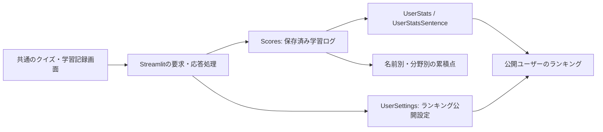

# 共通画面・個人進捗の更新（2026-09-06）

## 仕組みと今回の変更

6つのPython起動ファイルは、言語と初期出題モードを共通の `unified_app.py` に渡します。PC・スマートフォンとも `mobile_app/` の同じ画面を使い、以前の `?classic=1` でもこの画面を開きます。

- `Scores` は既存のまま正本として利用。個人進捗は全保存履歴を集計し、同じ `save_id` の重複を除外します。古い記録の品詞はグループ名から補い、不明な分野も未分類として得点を残します。
- パスワードは導入しません。名前を入力した人は、その名前の記録を閲覧・追加し、公開設定を変更できます。非公開の意味はランキング一覧に掲載しないことです。
- 公開設定を取得できない場合は、ランキングに取得エラーを表示します。未確認の設定を公開と扱わず、個人進捗と得点保存は独立して動かします。
- 名前付きの完了結果は自動保存。未送信結果を端末内に結果IDごとに保持し、通信再開・再読み込み後も同じIDで再送します。端末への保存自体が失敗した場合は、完了結果を新しいクイズで上書きしません。
- 旧PC版の端末保存は、案内から引継ぎを選んだ場合のみ変換し、原文を保持します。既存モバイル保存を優先します。旧完了結果の保存状況が不明な場合は閲覧専用です。

## 検証結果

| 検証 | 結果 |
|---|---|
| Pythonの単体・連携テスト | 103件成功 |
| JavaScriptの単体テスト | 43件成功 |
| 公開対象のデータ・全WAV検証 | 単語2,890件、例文5,000件、WAVヘッダ15,768ファイルの検査成功 |
| 実ブラウザー・ローカル仮シート | PCの共通入口、幅390pxの実iframe、名前切替、分野別得点、公開設定の保存、全4種類のランキングからの除外を確認 |
| クイズからの実保存 | 仮ユーザーで10問完了→232.5点を自動保存。途中再読み込みの復元と保存後再読み込みでの二重加算なしを確認 |
| 名前切替後の再挑戦 | 別名の非公開設定を見た後、元の名前で再挑戦しても元の得点・公開設定を表示 |
| 音声 | 仮シート環境で同梱の単語・例文音声の再生成功 |

ブラウザー回帰テスト2ファイルも新仕様に更新し、構文検査済みです。Playwrightの全ブラウザースイートは今回実行していません。実画面の検証には接続済みブラウザーと、実バックエンドをメモリ内シートへ接続したローカルfixtureを使いました。本番への仮得点追加はありません。

作業開始前から未追跡の旧文言WAVが3つあり、作業フォルダーをそのまま検査すると音声数不一致になります。これらを変更せず、Gitで管理する公開対象のデータ・音声だけを一時フォルダーに展開して、通常の厳密な検証を実行しました。既存の `node_modules/` 削除と未追跡文書も今回の変更には含めません。

## シートと本番反映

既存スプレッドシートへ `UserSettings` を追加しました。列は `user`, `ranking_public`, `updated_at` の3つで、データ行は空です。既存の `Scores` は197件・13名のままです。新しい得点用スプレッドシートの準備は不要です。

アプリの変更は作業ブランチにまとめています。本番で使用中のブランチへの取り込みとアプリ更新により、共通画面・個人進捗・公開設定が利用可能になります。起動・運用は [README](../README.md)、反映手順は [DEPLOY](../DEPLOY.md) を参照してください。
