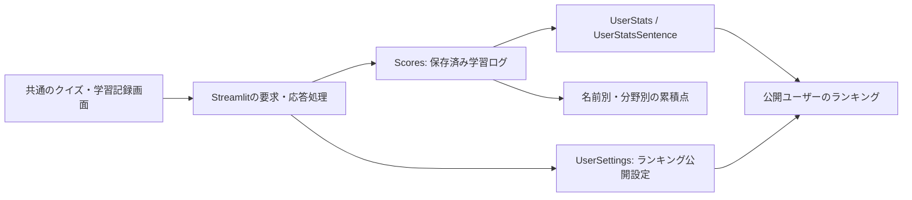

# 共通画面・個人進捗の更新（2026-09-06）

## 仕組みと今回の変更

6つのPython起動ファイルは、言語と初期出題モードを共通の `unified_app.py` に渡します。PC・スマートフォンとも `mobile_app/` の同じ画面を使い、以前の `?classic=1` でもこの画面を開きます。

- `Scores` は既存のまま正本として利用。個人進捗は全保存履歴を集計し、同じ `save_id` の重複を除外します。古い記録の品詞はグループ名から補い、不明な分野も未分類として得点を残します。
- パスワードは導入しません。名前を入力した人は、その名前の記録を閲覧・追加し、公開設定を変更できます。非公開の意味はランキング一覧に掲載しないことです。
- 公開設定を取得できない場合は、ランキングに取得エラーを表示します。未確認の設定を公開と扱わず、個人進捗と得点保存は独立して動かします。
- 名前付きの完了結果は自動保存。未送信結果を端末内に結果IDごとに保持し、通信再開・再読み込み後も同じIDで再送します。端末への保存自体が失敗した場合は、完了結果を新しいクイズで上書きしません。
- 旧PC版の端末保存は、案内から引継ぎを選んだ場合のみ変換し、原文を保持します。既存モバイル保存を優先します。旧完了結果の保存状況が不明な場合は閲覧専用です。

## 検証結果

| 検証 | 結果 |
|---|---|
| Pythonの単体・連携テスト | 123件成功 |
| JavaScriptの単体テスト | 53件成功 |
| 公開対象のデータ・全WAV検証 | 単語2,890件、例文5,000件、WAVヘッダ15,768ファイルの検査成功 |
| 実ブラウザー・ローカル仮シート | PCの共通入口、幅390pxの実iframe、名前切替、分野別得点、公開設定の保存、全4種類のランキングからの除外を確認 |
| クイズからの実保存 | 仮ユーザーで10問完了→232.5点を自動保存。途中再読み込みの復元と保存後再読み込みでの二重加算なしを確認 |
| 名前切替後の再挑戦 | 別名の非公開設定を見た後、元の名前で再挑戦しても元の得点・公開設定を表示 |
| 音声 | 仮シート環境で同梱の単語・例文音声の再生成功 |

Chromiumのブラウザー回帰テスト23件をGitHub Actionsの独立したジョブで実行します。確定結果はPRの `browser-regressions` チェックで確認できます。PC・スマートフォン表示、多言語、音声、個人進捗、アカウント別公開設定、保存・再読み込みに加え、保存確認用receiptの書込み失敗後の復元を検査します。実画面は接続済みブラウザーでも確認しました。書込みを伴う検証は全てメモリ内シートを使い、本番への仮得点追加はありません。Safari・Firefox・実機全機種の検証や、本番シートへの書込みテストは今回の確認範囲に含みません。

作業開始前から未追跡の旧文言WAVが3つあり、作業フォルダーをそのまま検査すると音声数不一致になります。これらを変更せず、Gitで管理する公開対象のデータ・音声だけを一時フォルダーに展開して、通常の厳密な検証を実行しました。既存の `node_modules/` 削除と未追跡文書も今回の変更には含めません。

## 実データの読み取り監査と追加修正

2026-09-06に既存シートを読み取り、保存済み197件・13名について、名前ごとの全体点と例文点を別計算し、`UserStats` / `UserStatsSentence` と照合しました。不一致、空の保存ID、重複した保存IDはありませんでした。

教材の単語2,890件は品詞の空欄なし、例文5,000件はテーマ・小テーマの空欄なしです。一方、保存記録には分類を判定できない古いテスト用の記録が1件（50点）あります。残る196件は分類でき、古い単語記録56件は `group_id` から品詞を補います。これは教材の未分類とは区別します。原本の行は削除・補正していません。ローカルfixtureの意図的な分類不足データも実シートの内容とは別です。

再現テストを追加して次を修正しました。

- 公開設定の保存後に通信が途切れても、古い公開要求を再送して後の非公開設定を上書きしない。
- receiptの端末保存に失敗しても、永続化されたセッション・履歴と厳密に照合し、再読み込み後の保存済み表示を維持する。保存証拠がない場合は同じIDでの再送を維持する。
- 得点保存・個人進捗・公開設定で名前の検証を統一する。
- 得点シートのヘッダに途中の空欄があっても、追加列によって既存列をずらさない。
- 今月ランキングに翌月以降の日付の記録を含めない。
- 本番の `scrolling="no"` iframeでも、長い学習記録・結果・診断をアプリ内でスクロールできるようにする。18テーマ・12件の端末履歴を使い、実際のホイール操作で末尾まで到達する回帰テストを追加する。
- 初期データの読み込み中は画面切替を無効にし、読み込み完了によって直前の操作がホームへ戻されることを防ぐ。
- 通常の再読み込みでも修正版CSSを取得できるよう、CSSのURLに版番号を付ける。版更新コマンドでアプリ・CSS・PWAキャッシュをまとめて更新する。

履歴の完全性を推定して累積点を引き下げる自動修復は行いません。旧ログの欠落・集計表の手修正がある環境では、進捗とランキングの差分を別途照合する必要があります。またGoogle Sheetsへの複数プロセスによる書込みを完全に直列化する仕組みはありません。今回のテスト成功は、あらゆる同時操作や将来の通信障害に対する無欠陥の保証ではありません。

## シートと本番反映

既存スプレッドシートへ `UserSettings` を追加しました。列は `user`, `ranking_public`, `updated_at` の3つで、データ行は空です。既存の `Scores` は197件・13名のままです。新しい得点用スプレッドシートの準備は不要です。

共通画面・個人進捗・公開設定は [PR #1](https://github.com/Takatakatake/esperanto_quiz/pull/1) で本番へ反映しました。その後、長い学習記録のスクロール不具合が報告され、修正とホイール操作の回帰検証を [PR #2](https://github.com/Takatakatake/esperanto_quiz/pull/2) にまとめています。起動・運用は [README](../README.md)、反映手順は [DEPLOY](../DEPLOY.md) を参照してください。
